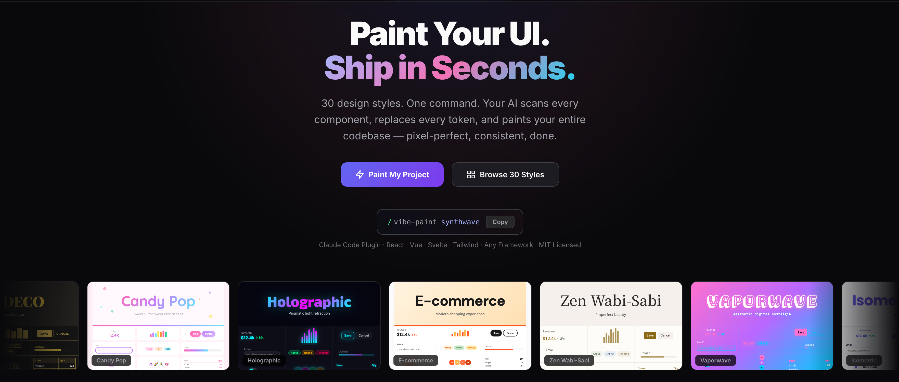

# vibe-paint

[English](./README.md)

**功能已经写完了。现在，给它换一张脸。**



vibe-paint 是一个 Claude Code 插件。一条命令，重新粉刷你整个项目的 UI —— 颜色、字体、圆角、阴影，全部替换，自动审查一致性和无障碍合规。

## 三步上手

```
# 浏览 30 种设计风格
/vibe-paint list

# 一键换肤（替换为任意风格名）
/vibe-paint synthwave

# 深度打磨（内容感知优化）
/vibe-paint polish
```

## 安装

**第 1 步** —— 添加市场源：

```
/plugin marketplace add LeifDiao/vibe-paint
```

**第 2 步** —— 安装插件：

```
/plugin install vibe-paint@vibe-paint-marketplace
```

**手动安装：**

```bash
git clone https://github.com/LeifDiao/vibe-paint.git ~/vibe-paint
claude --plugin-dir ~/vibe-paint
```

## 它解决什么问题

市面上有几百个 UI 库来 **搭建** 界面 —— Tailwind、MUI、Chakra、shadcn，从零开始用都很棒。

但你已经写完的项目呢？

也许你半年前上线了一个 SaaS 后台，现在品牌要升级。也许你是独立开发者，功能完美但视觉层太素。也许你就是想看看自己的产品换个风格会怎样 —— 但不想花一周时间翻遍 40 个文件，逐个替换 `#3B82F6`、`bg-blue-500`、`border-radius: 8px`。

vibe-paint 就是做这件事的。一条命令。整个项目。全新视觉。

```
/vibe-paint synthwave
```

它会扫描你的项目，理解每个组件的语义角色，把所有视觉 token 替换为目标风格，统一它发现的不一致之处，最后自动审查无障碍合规。如果你想更进一步，`/vibe-paint polish` 会做内容感知的深度打磨 —— 调整按钮层级、卡片深度、排版节奏 —— 因为机械替换能做到 90%，但最后 10% 需要理解 *你的 UI 到底在展示什么*。

## 它和其他工具有什么不同

| | UI 库（MUI、Chakra、Tailwind） | 设计工具（Figma、Framer） | **vibe-paint** |
|---|---|---|---|
| **什么时候用** | 项目开始前 | 项目开始前 | 项目已经写完之后 |
| **做什么** | 提供组件让你拼装 | 输出设计稿交给开发 | 重新粉刷已有代码 |
| **适用范围** | 新项目 | 新设计 | 已有项目 |
| **输出** | 从零开始写的代码 | 给开发看的规格文档 | 你的代码，换了层皮 |

## 命令一览

| 命令 | 功能 |
|------|------|
| `/vibe-paint [风格名]` | 完整换肤流程：扫描 → 粉刷 → 审查 |
| `/vibe-paint list` | 查看全部 30 种可用风格 |
| `/vibe-paint polish` | 深度内容感知 UI 打磨 |

## 工作原理

### Paint：换皮肤（`/vibe-paint synthwave`）

1. **SCAN（扫描）** —— 找到项目中每一处样式声明。但它不只是 grep 颜色值 —— 它理解每个组件 *是什么*。三个按钮分别叫 `btn-primary`、`main-btn`、`action-button`？同一个东西，统一处理。
2. **PAINT（粉刷）** —— 把所有视觉 token（颜色、字体、圆角、阴影）替换为目标风格。支持 CSS 变量、Tailwind 配置、CSS-in-JS 主题对象、行内样式、SVG 属性 —— 不管你的项目用什么方案。
3. **AUDIT（审查）** —— 自动验证。捕捉藏在 `:hover` 状态和三元表达式里的残留硬编码值。检查每一对颜色组合的 WCAG AA 对比度。发现问题直接修复。

### Polish：打磨体验（`/vibe-paint polish`）

Paint 让数值正确。Polish 让 *体验* 正确。

换肤之后，你的应用有了正确的颜色和字体 —— 但产品卡片和设置面板不应该仅仅因为都是"卡片"就有相同的视觉重量。Polish 理解你的内容：

- **理解** 你的项目类型（电商、后台、博客、SaaS）和每个组件的用途
- **评估** 当前 token 是否真正服务于每个组件 —— synthwave 的霓虹光晕用在表单标签上合适吗？
- **打磨** 按钮层级、阴影深度、排版节奏、交互状态
- **检查** 布局完整性 —— 溢出、z-index、换肤后的响应式表现
- **统一** 整体 UI —— 找到风格"断裂点"，统一 hover/focus/active 状态
- **审查** 最终一致性和无障碍合规

## 30 种风格，6 大分类

### 专业 & 功能型
| 风格 | 标识 | 适用场景 |
|------|------|----------|
| Clean Minimal | `clean-minimal` | SaaS、开发者工具 |
| Corporate Professional | `corporate-professional` | 企业级、金融科技 |
| Dashboard Data Dense | `dashboard-data-dense` | 数据分析、管理后台 |
| Ecommerce Modern | `ecommerce-modern` | 电商 |
| Mobile First Gesture | `mobile-first-gesture` | 移动应用、PWA |

### 视觉效果 & 深度
| 风格 | 标识 | 适用场景 |
|------|------|----------|
| Glassmorphism | `glassmorphism` | 落地页、作品集 |
| Neumorphism | `neumorphism` | 设置面板、仪表盘 |
| Claymorphism | `claymorphism` | 儿童应用、趣味品牌 |
| Aurora Gradient | `aurora-gradient` | 创意应用、营销页 |
| Bento Grid | `bento-grid` | 作品集、功能展示 |

### 大胆 & 表现力
| 风格 | 标识 | 适用场景 |
|------|------|----------|
| Neo Brutalism | `neo-brutalism` | 创意机构 |
| Cyberpunk Neon | `cyberpunk-neon` | 游戏、科技 |
| Swiss Typography | `swiss-typography` | 编辑排版、设计工作室 |
| Art Deco | `art-deco` | 奢侈品牌 |
| Isometric Playful | `isometric-playful` | 教育、游戏化 |

### 复古 & 怀旧
| 风格 | 标识 | 适用场景 |
|------|------|----------|
| Editorial Monochrome | `editorial-monochrome` | 杂志、出版 |
| Y2K Futurism | `y2k-futurism` | 时尚、流行文化 |
| Vaporwave | `vaporwave` | 艺术、音乐 |
| Synthwave | `synthwave` | 音乐、游戏 |
| Pixel Retro | `pixel-retro` | 独立游戏 |

### 触感 & 有机
| 风格 | 标识 | 适用场景 |
|------|------|----------|
| Skeuomorphic | `skeuomorphic` | 工具类应用 |
| Terminal Hacker | `terminal-hacker` | 开发工具、CLI |
| Warm Soft | `warm-soft` | 健康、社区 |
| Organic Earth | `organic-earth` | 医疗、环保 |
| Zen Wabi Sabi | `zen-wabi-sabi` | 冥想、极简 |

### 暗色 & 沉浸
| 风格 | 标识 | 适用场景 |
|------|------|----------|
| Dark Premium | `dark-premium` | 金融科技、高端 SaaS |
| Candy Pop | `candy-pop` | 社交、Z 世代 |
| Anime Gacha | `anime-gacha` | 游戏、二次元 |
| Grunge Underground | `grunge-underground` | 音乐、街头潮牌 |
| Holographic Futurism | `holographic-futurism` | Web3、未来感 |

## 技术覆盖

- CSS 自定义属性 / 变量
- Tailwind 工具类 + 配置
- CSS-in-JS（styled-components、emotion、MUI 主题、Chakra 主题）
- 行内样式（React `style={{}}`、HTML `style=""`）
- 组件库 props（MUI、Chakra、Ant Design、shadcn/ui）
- SVG fill/stroke 属性
- 字体导入和 meta theme-color
- SCSS/Less/Stylus 变量
- 渐变、阴影、圆角声明

## License

MIT
